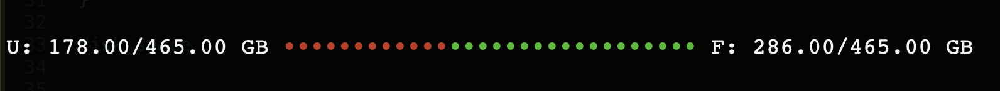

# terminal-disk-space-meter

Show disk space usage in zsh terminal graphically.

_Tested on zsh terminal v2.12.7 of macOS 12.6.1_





```BASH
function disk_space(){
	grx_max_char_length=20
	grx_ascii_char="•"

	data=`df -k / | grep -v Used | tr -s ' '` # get disk space data of root
	total_space=`echo $data | cut -d' ' -f2`
	free_space=`echo $data | cut -d' ' -f4`
	used_space=$[$total_space-$free_space]

	free_space_char_count=$[$grx_max_char_length*$free_space/$total_space]
	used_space_char_count=$[$grx_max_char_length-$free_space_char_count]

	printf "U: %.2f/%.2f GB" $[$used_space/1024/1024] $[$total_space/1024/1024]
	printf " "
	tput setaf 1 # set color green
	printf '%.s'$grx_ascii_char `seq 1 $used_space_char_count`
	tput setaf 2 # set color red
	printf '%.s'$grx_ascii_char `seq 1 $free_space_char_count`
	tput sgr0 # reset color
	printf " "
	printf "F: %.2f/%.2f GB" $[$free_space/1024/1024] $[$total_space/1024/1024]
	printf "\n"
}
```


### Usage

1. Add the above function in ```.zshrc```.
2. From prompt type ```disk_space```, disk space usage will be shown.

### Customize

1. To set max width of graph (by char), change variable ```grx_max_char_length```.
2. The view of the graph is built by ASCII char. Change it by setting ```grx_ascii_char``` variable. 
