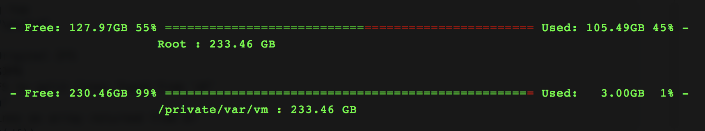

# terminal-disk-space-meter
Shall function that prints mounted disk space usage graph in terminal.

**Usage**:

`> disk_space_visual`

Min terminal width: 94

Function Defination: [script.sh](script.sh)
